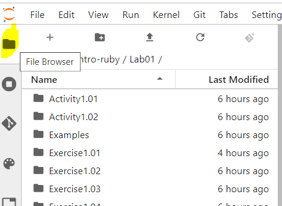
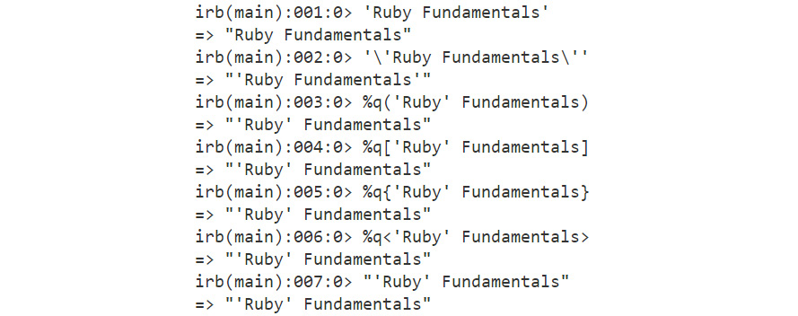

Lab 1. Writing and Running Ruby Programs
========================================


Overview
============

By the end of this lab, you will be able to use the Interactive Ruby
Shell (IRB) to write Ruby programs; execute Ruby code with a Ruby
interpreter using Ruby (.rb) files; implement variables, literals, and
constants in Ruby programs; use standard data types, such as numbers,
Booleans, and strings, in Ruby programs; execute basic arithmetic
operations on integer and floating-point numbers, implement string
concatenation and interpolation in Ruby programs.


Introduction
============

Ruby is a dynamic, interpreted, object-oriented programming language
developed by Yukihiro (\"Matz\") Matsumoto at some point in the
mid-1990s, with its first stable release in 1995. According to the
creator of Ruby, it is highly influenced by Perl, Smalltalk, Ada, and
Lisp. 

Being an interpreted scripting language, Ruby has the ability to make
system calls directly, and has a long list of useful string operations
where variable declaration and variable type are not required. Ruby
wholly embraces object-oriented programming because everything in Ruby
is an object. Ruby has a long list of keywords that make many operations
a piece of cake. This means you can do more with less code.


#### Pre-reqs:
- Google Chrome (Recommended)

#### Lab Environment
Exercises are ready to run. All packages have been installed. There is no requirement for any setup.

All examples are present in `work/intro-ruby/Lab01` folder. You can access lab at `http://<host-ip>/lab/workspaces/lab1_Programs`

To copy and paste: use **Control-C** and to paste inside of a terminal, use **Control-V**

**Note:**

- To open new terminal, click `File` > `New` > `Terminal`.
- Open file browser to open lab exercise(s) as shown below:




Key Features of Ruby
--------------------

A number of key features of the Ruby language make it really unique in
terms of working with it. It has very neatly assimilated the best
features of many programming languages. Here are a few features of Ruby
that make it a delight to program with:

-   Object-oriented
-   Interpreted language
-   Duck typing and dynamic typing
-   Multi-paradigm language
-   Reflection
-   Metaprogramming
    
    


Figure 1.1: Key features of Ruby


### Object-Oriented

Ruby is thoroughly object-oriented, and objects are the basic building
block of a Ruby program. Every value in Ruby is an object, even data
types such as strings, numbers, and Booleans: everything is an object.
This means that every object is part of a class that gives access to a
wide range of methods to do incredible things. Each class is also an
object in Ruby. Here\'s an example:

```
class Fruit
 #code
end
```


The preceding code defines the `Fruit` class. The following
code shows that two new objects, `fruit1` and
`fruit2`, are derived from the `Fruit` class:

```
fruit1 = Fruit.new
fruit2 = Fruit.new
```


### Interpreted Language

Ruby is an interpreted language, meaning that it\'s ready to run the
program as soon as you finish typing. Unlike programming languages such
as **C++**, **Java**, and **Objective-C**, which require code to be
compiled before running, this is not the case with Ruby. Look at this
example:

```
print "Hello World"
```


This code will immediately print `Hello World`, as follows:

```
Hello World
```


### Duck Typing and Dynamic Typing

Dynamic typing means a variable can refer to objects of various types
when the program is executed. There is no type checking in Ruby. Duck
typing is a principle that denotes that an object is based on the value
assigned to it rather than the type of variable. The underlying rule
here is: \"If it walks like a duck and quacks like a duck, then it must
be a duck.\" Here\'s an example:

```
x= [:a, :b, :c]
x.map(&:to_s) # => ['a', 'b', 'c']
```


The preceding example illustrates how the `x` variable
responds to `map` and returns the expected object. This means
that the `x` variable here is considered an **array**.


### Multi-paradigm Language

While languages are focused on one type of programming paradigm, besides
being object-oriented, Ruby also allows procedural and functional styles
of programming. The procedural paradigm refers to an instance where
procedure calls are interpreted as function calls. However, functions do
not exist in Ruby, and, therefore, methods can be created outside
classes. Look at this example:

```
self # => main
def method1
  "John is developing a program."
end
def method2
  "Jane is developing another program."
end
method1 # => "John is developing a program."
method2 # => "Jane is developing another program."
```


Here, `method1` and `method2` are defined outside
the classes; however, they are still a part of the `main`
object.

Additionally, Ruby also features the functional style of programming,
meaning it largely revolves around functions. Consider the following
example:

```
def ruby_method(obj)
  obj - 1
end
print ruby_method(5)
=> 4
```


Here, the `ruby_method` always stores the result of the object
passed as an argument, subtracting 1.


### Reflection

Reflection in Ruby makes it very easy to understand what\'s happening at
runtime because you can get a lot of information, such as class methods,
inheritance hierarchies, and all the living objects in your running
program. Here\'s an example:

```
class Box
  def hello
    "hello"
  end
end
# without reflection
obj = Box.new
obj.hello
# with reflection
class_name = "Box"
method_name = :hello
obj = Object.const_get(class_name).new
obj.send method_name
```


This shows that we can inspect every element of the code.


### Metaprogramming

Ruby supports metaprogramming, which is a technique that helps you to
write code that creates code on its own. This means it is able to create
methods and classes dynamically. With metaprogramming, you can write
methods and classes at runtime, which helps us to maintain a **Don\'t**
**Repeat** **Yourself** (**DRY**) and maintainable code base. Here\'s an
example:

```
['one', 'two', 'three'].each do |num|
  define_method(num) do
    num.upcase
  end
end
one # => "ONE"
two # => "TWO"
three # => "THREE"
```


The preceding code shows that we can make changes to the core
`Array` class at runtime and modify it as required.


Interactive Ruby Shell (IRB)
============================


The easiest way to start playing around with Ruby is by using **IRB**,
where **I** stands for **Interactive** and **RB** stand for the **.rb**
extension of the Ruby programming files. IRB is a command-line
interpreter and is also known as a **REPL** tool in Ruby, which means
**Read**, **Eval**, **Print**, and **Loop**, and was inspired by
Smalltalk. IRB is very useful for quick experiments, exploring Ruby, and
testing fragments of code quickly.

IRB comes out of the box with Ruby, and you can access it using the
`irb` command from the Terminal:

1.  Go to the Terminal (or Command Prompt) and type the following
    command:


    ```
    $ irb 
    >_ 
    ```


2.  Once the shell is open, you can type commands and get instant
    results. Try a simple `puts` command in Ruby using IRB:


    ```
    puts "Hello World"
    ```


    The output should be as follows:


Figure 1.2: Output for \"Hello World\"

**Note** `puts` or `p` is used to print any string or value
of a variable that follows `puts` or `p`.

Let\'s do some addition with the Interactive Ruby Shell:

1.  Go to the IRB shell.

2.  Type the following command:


    ```
    17 + 13
    ```


    The output should be as follows:


Figure 1.3: Addition output on irb

**Note** You can use IRB or any IDE to complete the exercises/activities in this book.


Exercise 1.01: Creating and Assigning Variables
-----------------------------------------------

In this exercise, we will create a variable, assign an operation to it,
and print it. Let\'s assign the calculation in the previous example to a
variable, such as the number of students, and print it in IRB:

1.  Go to the IRB shell or the IDE of your choice.

2.  Type the following code:


    ```
    number_of_students = 17 + 13
    ```


    You should get the sum of 17 and 13 in the output.

3.  Next, we print the value carried by the
    `number_of_students` variable:


    ```
    puts number_of_students
    ```


    The output should be as follows:


Figure 1.4: Output for assigning variables

**Note** The Ruby variable stores the value assigned to a variable in one IRB
session, as seen here with `number_of_students`.

Before we start the next exercise, please note that data types in Ruby
symbolize various types of data, such as strings, numbers, decimal
numbers, and text. All of these data types are based on classes; for
example, `string` is an object of the `String`
class, since Ruby is an object-oriented language. We will discuss a
variety of data types in Ruby later in this lab.


Exercise 1.02: Assigning a Variable of One Data Type to a Different Type
------------------------------------------------------------------------

In this exercise, we will assign a string value to a variable of the
integer data type. It is not necessary that a variable, once assigned,
stays the same type forever. Let\'s assign a variable that holds an
integer and another variable that has a string value:

1.  Continue from the previous example (if you are starting here, please
    complete *Exercise 1.01, Creating and Assigning Variables*).

2.  Type the following code:


    ```
    number_of_students
    ```


    This should give you an output of `30` as this was the
    value assigned in the previous exercise.

    Next, we assign a different value to the
    `number_of_students` variable:


    ```
    number_of_students = "not enough for a session"
    => "not enough for a session"
    ```


    The output should be as follows:


Figure 1.5: The output for variables assigned to a different data type

We can simply change the data type of a variable with the inbuilt Ruby
methods. For example, to convert an integer to a string, we can use
**.to\_s**, and we can convert a string to an integer with **.to\_i**.

We will study Ruby methods in detail in the later sections of this
lab.


Exercise 1.03: Getting the Type of a Variable
---------------------------------------------

In this exercise, we will get information about the data type of a
variable. Continuing on from the previous exercise, we can get a lot of
information about the variable. First, let\'s see from which class the
variable is derived. This can be achieved using the dot (`.`)
operator on the variable itself.

1.  Continue from the previous example (if you are starting here, please
    complete *Exercises 1.01, Creating and Assigning Variables* and
    *1.02, Assigning a Variable of One Data Type to a Different Type*).

2.  Now, we will try to identify the data type of our
    `number_of_students` variable using `.class`:


    ```
    number_of_students.class
    ```


    The output should be as follows:

    
    


    Figure 1.6: Output of the data type of a variable

    `.class` tells us about the class that the variable
    belongs to.

3.  The same can be achieved using the `::` operator:


    ```
    number_of_students::class
    ```


In Ruby, the `.` and `::` operators almost work in
the same way. There is no major difference between `::` and
`.` when calling static methods. However, you may use the
`::` operator to access constants and other name-spaced
things, where using the dot (`.`) operator is not possible.
Aesthetically, `.` operator is preferable to `::`
operator.


Getting the Details of the Public Methods of an Object
------------------------------------------------------

We will now see various public methods that are available for an object
by default from Ruby. Everything in Ruby is an object; the **class**
itself is an object of **Class**. We can then check what interfaces are
available for an object. Let\'s now see what public methods are
associated with this object:

```
number_of_students.public_methods
```


The output should be as follows:


Figure 1.7: Output for public methods

You can use all of the preceding public methods on this object to
execute various operations and manipulate the value set in the object.
If you look closely, some of the methods are self-explanatory, such as
`upcase`, and `downcase` (we will discuss individual
data types and their **class** later in this lab).


Running Ruby Code from Ruby Files
---------------------------------

In the previous section, we used **IRB** to execute some code snippets
from the Terminal. But that\'s not usually the case when you write Ruby
code. Whether you use a framework or run a standalone Ruby code, you
would keep your code inside a Ruby file, which, in layman\'s terms, is a
file with the `.rb` extension.

Let\'s try creating a `hello_world.rb` file and place some
Ruby code in it. You can use your choice of IDE or simply use the
Terminal.

1.  Create a new file and add the following code to it:


    ```
    puts "***"
    puts  "*****"
    puts  "*******"
    puts  "Hello World"
    puts  "*******"
    puts  "*****"
    puts  "***"
    ```


2.  Save this file in the desired location with the `.rb`
    extension. For example, save it as `hello_world.rb`.

3.  To execute this code, fire up your Terminal.

4.  Run the following command from root where your Ruby file is saved:


    ```
    $ ruby hello_world.rb
    ```


    The output should be as follows:


Figure 1.8: Output of the hello world program

So far, we have learned how to print any value from a variable. Now that
we know how to write and execute a code from a Ruby file, let\'s up the
ante a bit by getting user input.


Exercise 1.04: Getting User Input in a Ruby Program
---------------------------------------------------

In this exercise, we will get the user to input some numerical data and
perform a simple addition. To do so, follow these steps:

1.  Open your choice of IDE or the Terminal application.

2.  Create a new file.

3.  Add the following code to it. We use `puts` to print a
    string. The `gets` function is used to allow the input
    data to be stored in the `num` variable:


    ```
    puts  "Please enter a number to added to 5"
    num = gets
    sum = 5 + num.to_i
    puts  "The result is"
    puts sum
    ```


    We have converted the `num` variable explicitly to an
    integer using the built-in `to_i` method.

4.  Save the file as `sum.rb`.

5.  Open the Terminal and execute the following code:


    ```
    $ ruby sum.rb
    ```


    The output should be as follows:


Figure 1.9: Output for user input in Ruby

By using the `gets` method, we were able to capture input from
the user. When you executed the Ruby file, the cursor stopped for the
input. The same input, as captured by the `gets `method, was
used and added to `5`.

Alternatively, there is a method called `gets.chomp` that
removes the trailing line character from a string. Typically, the
`gets` method will input the entire string, including the line
break character. `gets.chomp` will remove line break
characters from strings.


Standard Data Types
===================


The three major data types used in Ruby are as follows:

-   Number
-   String
-   Boolean

We shall look at each of these data types in detail in this section.


Number
------

Numbers in Ruby are objects that derive from the **Numeric** class.
Let\'s look at the class hierarchy for various number types:


Figure 1.10: Number class hierarchy

Of all of these, two of the most commonly used number types are
**integer** and **float**, and there are a number of methods associated
with both integer and floating-point numbers. Let\'s take a look at them
one by one.

In Ruby, integers are represented by two classes: **Fixnum** and
**Bignum**:


Figure 1.11: Integer types

Both of them are inherited by the **Integer** class. As the name
suggests, the **Bignum** class represents big numbers, and **Fixnum** is
used to represent small numbers. Ruby manages the conversion between the
two automatically. For example, if the result of an operation of two
**Fixnum** numbers is outside the **Fixnum** range, it\'s converted to
**Bignum**. From Ruby 2.4 onward, Ruby has unified these classes and
automatically uses the **Fixnum** class for small numbers and **Bignum**
for large numbers.


Exercise 1.05: Performing Common Integer Operations
---------------------------------------------------

In this exercise, we will perform common mathematical operations such as
addition (`+`), subtraction (`-`), multiplication
(`*`), and division (`/`) in Ruby:

1.  Go to the Terminal.

2.  Type `irb` to enter the IRB.

3.  Type the following code:


    ```
    1 + 2
    ```


    The output should be as follows:

    
    


    Figure 1.12: Output for the addition operator

4.  Perform subtraction using the `-` operator:


    ```
    3 - 1
    ```


    The output should be as follows:

    
    


    Figure 1.13: Output for the subtraction operator

5.  Perform multiplication using the `*` operator:


    ```
    3 * 3
    ```


    The output should be as follows:

    
    


    Figure 1.14: Output for the multiplication operator

6.  Perform division using the `/` operator:


    ```
    10 / 2
    ```


    The output should be as follows:


Figure 1.15: Output for the division operator

You may ask yourself how is the principle of BODMAS (Bracket, Open,
Division, Multiplication, Addition, and Subtraction) managed by Ruby
automatically. Ruby follows an order of precedence for operators, which
defines the order in which the operators will take priority in any
equation. We will learn about precedence in *Lab 3, Program
Workflow.*

**Note** You can also divide up long integers by separating them with an
underscore. For example, 121\_334 will be read in Ruby as 121334


Exercise 1.06: Using Common Integer Methods to Perform Complex Arithmetic
-------------------------------------------------------------------------

In this exercise, we will try some common integer methods to make
complex operations trivial. We will perform operations to calculate the
next and previous numbers and calculate the Least Common Multiple (LCM)
and Greatest Common Denominator (GCD) using built-in methods.

LCM is a method that finds the smallest multiple common to any two or
more numbers, whereas GCD finds the largest divisor common to two or
more numbers.

The following steps should help you with the solution:

1.  Go to the Terminal.

2.  Type `irb` to enter the IRB.

3.  Type the following code. `.next` will provide the next
    number:


    ```
    2.next
    ```


    The output should be as follows:

    
    


    Figure 1.16: Output for the next number

4.  Next, we will calculate the previous number using `.pred`:


    ```
    2.pred
    ```


    The output should be as follows:

    
    


    Figure 1.17: Output for the previous number

5.  Then we calculate the LCM of 2 and 3 using `.lcm`:


    ```
    2.lcm(3)
    ```


    The output should be as follows:

    
    


    Figure 1.18: Output for the LCM of 2 and 3

6.  We also calculate the GCD of 2 and 3 using `.gcd`:


    ```
    2.gcd(3)
    ```


    The output should be as follows:


Figure 1.19: Output for the GCD of 2 and 3

Most of these methods are self-explanatory, but let\'s go through each
of them:

-   `.next` provides the next integer value.
-   `.pred` provides the preceding integer value.
-   `.lcm` gives us the least common multiple of the integer
    to which the method is applied and the value passed.
-   `.gcd` provides the greatest common divisor of the integer
    to which the method is applied and the value passed.

There are a number of methods available for the integer class, which you
can play around with. Simply check them by using `.methods` on
the integer.

Go to the Terminal. Type `irb` to enter the IRB and type the
following code:

```
2.methods
```


The output should be as follows:


Floating-Point Numbers
----------------------

Next, let\'s look into floating-point numbers. Floats are essentially
imprecise decimal numbers in Ruby; we use the **Float** class with 15
digits of precision.

There are two ways to write floating-point numbers:

-   1.121 -- with a decimal point
-   1.0e3 -- adding an exponent provided there is one number before and
    after the decimal point


Exercise 1.07: Performing Common Operations for Floating-Point Numbers
----------------------------------------------------------------------

In this exercise, we will try some common floating-point methods to make
complex operations easy. We will also learn how to calculate the
previous and next decimal number, as well as how to round off a decimal
number completely or up to a certain decimal point:

1.  Go to the Terminal.

2.  Type `irb` to enter the IRB.

3.  Type the following code. Firstly, we have assigned our
    floating-point value to a `num` variable and applied
    various methods to it:


    ```
    num = 2.339
    num.ceil
    num.floor
    ```


    `.ceil` returns the closest next integer, and
    `.floor` returns the closest previous integer.

4.  Then we have `.next_float`. This returns the next
    floating-point value, which is an increment in the last digit of the
    number to 15 decimal places. Similarly, `.prev_float`
    returns the previous floating point value to 15 decimal places:


    ```
    num.next_float
    num.prev_float
    ```


5.  Next, we have `.round`, which removes the values after the
    decimal. If the value after the decimal point is less than 5, you
    get the previous integer, and if it is over 5, you get the next
    integer. When we pass a number to `.round(2)`, we get a
    floating-point value to two decimal places:


    ```
    num.round
    num.round(2)
    ```


    The output should be as follows:


Figure 1.21: Output for floating-point number operations

There are a number of methods available for the `Float` class,
which you can play around with. Simply check them against
`.methods` on any integer:

1.  Go to the Terminal.
2.  Type `irb` to enter the IRB.
3.  Type the following Ruby code:


    ```
    2.15.methods
    ```


The output should be as follows:


Figure 1.22: Methods for the Float class

**Note** To find out more about all the methods and the operations they can
perform, refer to the official documentation at <https://ruby-doc.org/core-2.5.0/Float.html>.


String
------

Strings in Ruby are derived from the **String** class, and there are
over 100 methods to manipulate and operate on strings. This is perhaps
because, in programming, a lot revolves around strings, and Ruby reduces
the headache by managing a lot out of the box.

By default, Ruby comes with UTF-8 encoding, but this can be changed by
placing a special comment at the top of a file:

```
# encoding: us-ascii
puts "Hello".encoding
output:
ruby strings.rb
#<Encoding:US-ASCII>
```


**Note** If you remove the comment, by default, it will be UTF-8.

There are various ways to write strings in Ruby. These are some of the
most common ones:

-   We can simply place anything between single quotes (`''`)
    and it becomes a string:


    ```
    'Ruby Fundamentals'
     => "Ruby Fundamentals"
    ```


-   In order to keep the single quote with the letters, we can escape it
    using the backslash character (`\`):


    ```
    '\'Ruby Fundamentals\''
     => "'Ruby Fundamentals'"
    ```


-   We can also use `%q`, as shown in the following examples,
    and place the required string in a delimiter, which can be a
    bracket, curly brackets, or something else:


    ```
    %q('Ruby' Fundamentals)
     => "'Ruby' Fundamentals"
    %q['Ruby' Fundamentals]
     => "'Ruby' Fundamentals"
    %q{'Ruby' Fundamentals}
     => "'Ruby' Fundamentals"
    %q<'Ruby' Fundamentals>
     => "'Ruby' Fundamentals"
    ```


-   We can also use double quotes (`""`), which is the
    cleanest way to define a string.


    ```
    "'Ruby' Fundamentals"
     => "'Ruby' Fundamentals"
    ```


    The output of all the preceding code should be as follows:





Figure 1.23: Ways to write strings in Ruby


Exercise 1.08: Using Common String Methods
------------------------------------------

In this exercise, we will perform a number of common operations on a
string. We will first assign a string to a variable, then find its size
and length, and then change the case of the String value. We will then
capitalize the string. All this will be done using the **String**
class\' built-in methods. Lastly, we will discuss the bang
(`!`) operator and see how adding it impacts the results:

1.  Go to the Terminal.

2.  Type `irb` to enter the IRB.

3.  Enter the following code to define the string:


    ```
    title = "ruby fundamentals"
    ```


    The output should be as follows:

    
    


    Figure 1.24: Output for string definition

    Here, we are using the `ruby fundamentals` value for the
    title variable on which all the following operations will be
    executed.

4.  Next, we check the number of characters in this string, including
    white spaces, using `.size`:


    ```
    title.size
    ```


    The output should be as follows:

    
    


    Figure 1.25: Character count of a string

5.  Then, we also check the number of characters in this string,
    including white spaces, using `.length`:


    ```
    title.length
    ```


    The output should be as follows:

    
    


    Figure 1.26: String length calculation

    `.length` is the same as size, but it is more meaningful
    in certain situations. Mostly, it is a matter of preference. Some
    developers prefer using `.size` for large collections of
    data, such as arrays, and hashes, and `.length` for
    smaller collections of data, such as strings.

6.  Next, we change the case of the string characters to uppercase using
    `.upcase`:


    ```
    title.upcase
    ```


    The output should be as follows:

    
    


    Figure 1.27: Uppercase string characters

7.  Similarly, we can change the casing to lowercase using
    `.downcase`:


    ```
    title.downcase
    ```


    The output should be as follows:

    
    


    Figure 1.28: Lowercase string characters

8.  We can also capitalize the first character of the string using
    `.capitalize`:


    ```
    title.capitalize
    ```


    The output should be as follows:

    
    


    Figure 1.29: Capitalized string characters

    **Note** that even after the operations are applied on the string, the
    original string object remains the same:


    ```
    title
    ```


    The output should be as follows:

    
    


    Figure 1.30: Original string object

9.  Let\'s now try the **bang** method. **Bang** methods end with an
    exclamation mark (`!`), and we can use them to modify the
    original object with the result of the operation. Since the **bang**
    method can permanently modify the receiver (the original value), it
    should be used carefully:


    ```
    title.capitalize!
    title
    ```


    The output should be as follows:


Figure 1.31: Bang operation on a string

There are other operations as well that we can perform on strings, a
common one being concatenation.


Exercise 1.09: Performing String Concatenation
----------------------------------------------

In this exercise, we will be concatenating two string values that are
assigned to different variables. We will solve the same problem in three
ways:

-   Using the `+` operator
-   Using the `.concat` method
-   Using the `<<` operator

The following steps will help you to perform the exercise:

1.  Go to the Terminal.

2.  Type `irb` to enter the IRB.

3.  Enter the following code. We first define the strings as
    `var1` and `var2`:


    ```
    var1 = "Ruby"
    var2 = "Fundamentals"
    ```


4.  Next, we concatenate the two strings using whitespace:


    ```
    title = var1 + ' ' + var2
    ```


    The output should be as follows:

    
    


    Figure 1.32: Output using whitespace

    To add a space between `var1` and `var2` in the
    final result, you can do this by chain two `+` operators
    with a whitespace in-between.

5.  We can also do the same with the `.concat` method and
    modify the Ruby code:


    ```
    title = var1.concat(var2)
    ```


    The output should be as follows:

    
    


    Figure 1.33: Output using the .concat method

6.  We can also concatenate the strings using the `<<`
    operator:


    ```
    title = ""
    var1 = "Ruby"
    title << var1
    title << " "
    var2 = "Fundamentals"
    title << var2
    ```


    The output should be as follows:


Figure 1.34: Concatenation using the \<\< operator

Another way of accomplishing string manipulation is by using a technique
called string interpolation. This works much more elegantly than the
previous methods and allows you to combine the elements of different
types together in a string. With string interpolation, we can combine
strings and embed Ruby expressions in a string.


Exercise 1.10: Performing String Interpolation
----------------------------------------------

In this exercise, we will use the title variable that contains a value
for Ruby Fundamentals and interpolate it in a sentence:

1.  Go to the Terminal.

2.  Type `irb` to enter the IRB.

3.  Define the string:


    ```
    title = "Ruby Fundamentals"
    puts "My Favorite Ruby book is #{title}"
    ```


    The output should be as follows:

    
    


    Figure 1.35: String interpolation

4.  We can also perform operations with string interpolation, for
    example, addition within a string:


    ```
    puts "My Favorite Ruby book is #{title} and I am using it for last #{10+30} days"
    ```


    The output should be as follows:


Figure 1.36: Addition operation in string interpolation

This is how we carry out addition operations with string interpolation.


Exercise 1.11: Extracting and Searching a Substring from a String
-----------------------------------------------------------------

To extract certain characters from a string, follow these steps:

1.  Go to the Terminal.

2.  Type `irb` to enter the IRB.

3.  Define the string and then extract the characters, starting from the
    eighth position in an index to the second position from it:


    ```
    quote = "Just Do IT"
    quote[8,2]
    ```


    The output should be as follows:

    
    


    Figure 1.37: Extracting characters from a string

    Thus, we have extracted characters, starting from the eighth
    position in an index to the second position from it, and hence get
    the characters `IT`.

4.  Now, we will use string methods that can check whether a certain
    character, or group of characters, exists in a string object:


    ```
    quote = "Just Do IT"
    quote.include?("Just")
    quote.include?("just")
    ```


    The output should be as follows:


Figure 1.38: Searching a substring from a string

Here, the characters must be together and in exactly the same order.


Exercise 1.12: Replacing Part of a String with Another String
-------------------------------------------------------------

In this exercise, we will replace the word `Java` in the
sentence \"My favorite book is Java Fundamentals\" with the word
`Ruby`. To do so, follow these steps:

1.  Go to the Terminal.

2.  Type `irb` to enter the IRB.

3.  Store the sentence `My favorite book is Java Fundamentals`
    in `title`:


    ```
    title = "My favorite book is Java Fundamentals"
    ```


4.  Type the following code, which replaces the word `Java`
    with `Ruby` in `title`:


    ```
    title["Java"] = "Ruby"
    ```


5.  Print `title` to confirm the change:


    ```
    title
    ```


    The output should be as follows:


Figure 1.39: Replacing string characters

We have now easily updated the specific value of the string object in
the `title` variable.

If the original title was
`My favorite Java book is Java Fundamentals`, we have Java
repeated twice. In this case, only the first instance of Java would be
replaced. The output would be
`My Favorite Ruby book is Java Fundamentals`. This is where
the `gsub` method comes into play. It is used to globally
substitute a character, or set of characters, with another.


Exercise 1.13: Replacing All the Values inside a String Using gsub
------------------------------------------------------------------

In this exercise, we will use the `gsub` method to replace all
the instances of Java with Ruby in a sentence:

1.  Go to the Terminal.

2.  Type `irb` to enter the IRB.

3.  Define the string value and apply the `gsub` method as
    follows:


    ```
    title = "My Favorite Java book is Java Fundamentals"
    title.gsub("Java", "Ruby")
    ```


    The output should be as follows:


Figure 1.40: Using the gsub method to replace characters in a string

This way, we can easily replace the same values across the object using
`gsub`. This is very handy when we have to replace one
character that is repeated and acts as noise in data with something
meaningful.


Exercise 1.14: Splitting a String and Joining a String
------------------------------------------------------

In Ruby, we can split a string, which gives the result in an array (we
will learn about arrays in the next lab). In this exercise, we are
going to split a string of words into an array of words.

1.  Go to the Terminal.

2.  Type `irb` to enter the IRB.

3.  Define the string and use the `.split` method to divide
    the string into an array of words:


    ```
    title = "My Favorite book is Ruby Fundamentals"
    title.split
    ```


    The output should be as follows:

    
    


    Figure 1.41: Splitting a string

4.  Use the `split` method to separate values in a string:


    ```
    months = "Jan; Feb; Mar"
    months.split(';')
    ```


    The output should be as follows:

    
    


    Figure 1.42: Splitting a string using a unique character

5.  Join the array values in a string:


    ```
    data = ["My", "Favorite", "book", "is", "Ruby", "Fundamentals"]
    data.join
    ```


    The output should be as follows:


Figure 1.43: Joining arrays to form a string

Thus, we have successfully used `data.join` to bring together
values in a string.

The `string` class has several methods. You can use the
following code to check the methods available in the string class:

```
"abc".methods
```


It lists all the methods that are present in the
string class:


Activity 1.01: Generating Email Addresses Using Ruby
----------------------------------------------------

Imagine you have to write a Ruby program for a company (with the
**rubyprograms.com** domain), which will generate a roster of email IDs
of the company\'s employees. For this, we just need to accept user input
in the form of the first name and last name of each employee and place
them in an email format, which means adding an `@` symbol
between the two.

Observe the following steps to complete the activity:

1.  Create variables to accept the first names and last names of the
    individuals.

2.  Use `gets.chomp` to accept string input from users.

3.  Combine the first name and last name with the domain name and print
    the result.

    The expected output is as follows:


Figure 1.45: Output for email address generation

**Note** The solution to the activity can be found on page 458.


Boolean
-------

Unlike other languages, Ruby does not have a Boolean type, but it has
true and false Boolean values, which are essentially instances of the
**TrueClass** and the **FalseClass**, respectively. These are singleton
instances, which means that you can\'t create other instances of these
classes.

Let\'s test this with an example:

```
a = nil
 => nil
a.nil?
 => true
```


The output should be as follows:


Figure 1.46: True and false classes

You get Boolean values when you check whether the `a` variable
is `nil`.

We will learn more about the Boolean data type in *Lab* *3*,
*Controlling* *Program* *Flow.*


Activity 1.02: Calculating the Area and Perimeter of a Candy Manufacturing Plant
--------------------------------------------------------------------------------

In this activity, we will be using radius as the input to calculate the
area and perimeter of a candy manufacturing plant.

Follow these steps to complete the activity:

1.  Go to the Terminal and use `irb` to enter the IRB.

2.  Define the variables for `radius`, `perimeter`,
    and `area`.

3.  Calculate the value received from user input stored in the radius
    variable and print the results for `area` and
    `perimeter`.

    The expected output is as follows:


Figure 1.47: Output for area and perimeter

**Note** The solution to the activity can be found on page 459.


Summary
=======


In this lab, we learned about the fundamentals of Ruby and its key
features. We started with the history of Ruby and the key programming
paradigms the language supports that make it unique and powerful at the
same time. We then learned about using Ruby code with the IRB and also
learned how to write code in Ruby files and execute it. Next, we delved
into the standard data types in Ruby, which are number, Boolean, and
string. Here, we implemented various operations on variables along with
commonly used string operations, such as string concatenation and
interpolation.

In the next lab, we will learn how to work with data structures such
as arrays and hashes. We will explore the details of the various
powerful methods associated with them, and we will also learn how to
create our own Ruby methods and call them, which is the bedrock of
day-to-day programming with Ruby.
