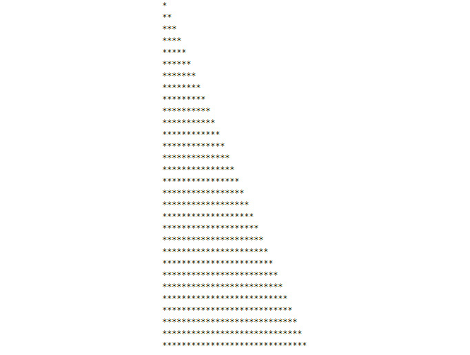
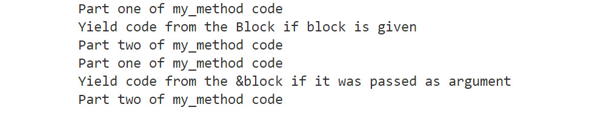
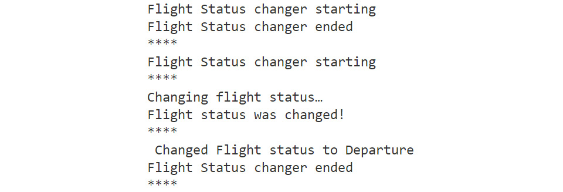
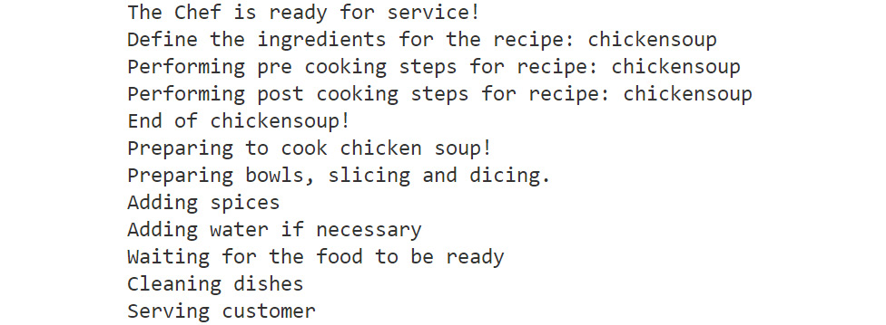
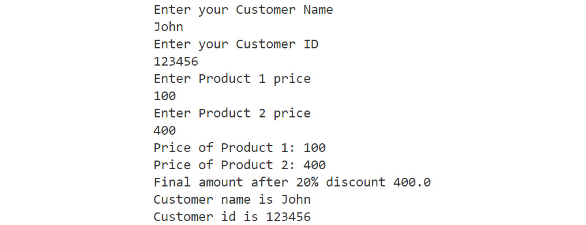

9. Ruby Beyond the Basics l
===========================


Overview

By the end of this lab, you will be able to use blocks to improve
code reusability; implement yield with blocks to maintain control over
program flows; implement procs and lambdas with blocks and compare procs
and lambdas.

This lab aims to give you a general overview of metaprogramming.


Introduction
============


In the previous chapters, we learned how to debug Ruby programs using
the `logger` class. In this lab, we will learn about some
of the advanced topics of the Ruby programming language, such as
`blocks`, `procs`, and `lambdas`. By now,
you must have realized that it\'s really easy to start writing Ruby
code, create sample apps, and get instant gratification; however, every
new Ruby developer (and sometimes the experienced ones too) will have a
question buzzing in their mind about how it actually works.

We can safely call it the Ruby magic, and that\'s what we are planning
to crack in this lab. We are going to learn about advanced
programming techniques that are present in other languages, but this
time the Ruby-specific implementation is our focus. We will tear down
the curtain from the syntactic sugar and take a look under the hood to
reveal what metaprogramming is. Additionally, we will lay a strong
foundation that will allow you to reuse these techniques and enable you
to utilize the libraries provided by Ruby. Later, when we learn about
Ruby on Rails in the upcoming chapters, it will be easier to comprehend
various features and how they operate behind the scenes.


Metaprogramming
===============


You might be wondering what **metaprogramming** actually is. Well, it is
utilized by most programming languages. Technically, it\'s a piece of
code that writes code by itself dynamically. With metaprogramming, you
can create methods and classes at runtime. It allows you to reopen or
even modify classes, as well as add methods to classes on the fly. It
helps to maintain the **Don\'t Repeat Yourself** (**DRY**) principle in
programming; however, it is a hard concept to grasp and get right.

Let\'s imagine the scenario of a chef in a restaurant. This chef needs
to know many recipes and be able to put together food for their
customers. Each food item requires different steps for preparation.
There are some steps that need to be done before, during, and after the
food is prepared. In order to create a simulation for these steps to be
performed by an automated system, you might consider using the
metaprogramming feature provided by the Ruby language.

Metaprogramming makes use of multiple elements available within the Ruby
language. Let\'s take a look at the first building block, which is
called `blocks` in Ruby.


Blocks
------

Blocks are like anonymous functions -- `lambdas` -- that can
be passed into a method. You may also refer to the use of a block as
passing a method into a method. The slight difference in blocks and
methods is that they do not belong to an object. In other languages,
such as C\#, Java, or Python, this concept is called
`closures`. Blocks are just the Ruby way of implementing
closures. Blocks are typically used when we would like to encapsulate
functionality that is made up of a sequence of statements. For example,
we could encapsulate an \"Introduction Letter\" email when new people
arrive at a company, where we just have to pass a template to a block
and it automatically generates and sends the email. The only variable
here is the detailed information of the new colleague in the template.


Syntax for Blocks
-----------------

There are two ways to write blocks: they can be either enclosed in
`do`/`end` or within curly brackets
(`{}`). Let\'s examine a simple example showing how to write
them.


### With do/end

Consider the following example:

```
(1..5).each do
  puts "I am inside the block"
end
```


The output would be as follows:


Figure 9.1: Output using do/end


### With curly brackets ({})

Consider the following example:

```
5.times {puts "I am inside the block"}
```


The output would be as follows:


Figure 9.2: Output using curly brackets

Besides this, we can also use the `yield` keyword to write
blocks, which we will discuss shortly.

In Ruby, many built-in `class` methods allow you to pass
blocks. This helps in enhancing the feature set provided by the built-in
methods.

The preceding examples are pretty basic for understanding block syntax.
Let\'s try and understand this with another example of using a block as
an iterator variable in order to print something:

```
def star_tree number 
  1.upto(number).each do |i|
    puts "*" * i 
  end
end
star_tree 30
```


Fire up your Terminal and run this Ruby file:

```
$ ruby block-iterator.rb
```


The output would be as follows:





Figure 9.3: Using a block as an iterator

Let\'s understand what we have done here. We are calling a
`star_tree` method and passing a value of `30` to
it, which is then used by the block as an iterator variable number,
which helps to create a behavior inside each method. This was a very
simple implementation of blocks that is used quite often in real-world
programming. Let\'s learn about `yield` and how to use it with
blocks to make really powerful programs.

Blocks can be passed to methods just like any other parameter. We have
been using blocks all along without realizing it. Take a look at the
preceding code with `.each`. What is running inside a
`.each` method is a block, and we define what needs to be
implemented in that `.each` method.

The ability of blocks to be passed as parameters makes them a great
candidate for applying abstraction, which is a very important concept of
object-oriented programming (OOP).


yield with Blocks
-----------------

The `yield` construct in Ruby is essentially a way to call a
block. Wherever you use this keyword, the block code will be executed
there. If there is code before the `yield` construct, it will
be executed first and then the rest of the code is executed. Other
programming languages, such as Python and JavaScript, also utilize the
`yield` construct. You can `yield` an empty block;
however, nothing will happen as there is nothing to execute.

Let\'s understand this with an example:

```
def my_method(&block)
  puts "Part one of my_method code"
  yield
  puts "Part two of my_method code"
end
my_method {puts "Yield code from the Block"}
```


The `&block` argument expects a block that will be executed
when the control reaches the `yield` line.

The output would be like the following:


Figure 9.4: Output for yield with blocks

Let\'s understand this program. We pass a block of code to the
`my_method` function which executes the block when the control
reaches the `yield` statement. Now, imagine the possibility of
using the `yield` keyword to pass a block of code with some
operations. With `yield`, you can do all the behind-the-scenes
magic we generally associate Ruby methods with.

If we try printing `yield` twice, or maybe after the second
`puts` statement in `my_method`, the
`yield` construct will call each line of the block that you
pass to the program. If you pass two statements, each statement will be
executed as many times as there are `yield` statements in the
code.

Consider the following example:

```
def my_method(&block)
  puts " Before first yield"
  yield
  puts " After first yield"
  yield
end
my_method {puts "What happens with two yields?"}
```


The output of the first `yield` call with one statement will
be as follows:


Figure 9.5: Output for yield with one statement

Now let\'s take a look at the output for multiple statements:

```
my_method do
puts "First statement"
puts "Second statement"
end
```


The output should be as follows:


Figure 9.6: Output for yield with multiple statements


Exercise 9.01: Building a Simple Calculator
-------------------------------------------

In this exercise, we will be creating a simple calculator that performs
basic arithmetic operations such as addition, subtraction,
multiplication, and division. We will be using Ruby blocks and
`yield` to create reusable code. The following steps will help
you complete the exercise:

1.  Create a Ruby `block-yield.rb` file.

2.  Define our `calculator` block. We use the
    `yield` keyword, which will use the block of code passed
    along with the `a` and `b` variables, which are
    used in the arithmetic operations:


    ```
    def calculator(a, b)
      yield(a, b)
    end
    ```


3.  Next, we add the calls for addition, subtraction, multiplication,
    and division:


    ```
    #Addition
    puts calculator(8, 2) { |a, b| a + b }
    #Multiplication 
    puts calculator(8, 2) { |a, b| a * b } 
    #Subtraction
    puts calculator(8, 2) { |a, b| a - b }
    #Division
    puts calculator(8, 2) { |a, b| a / b }
    ```


    Save the file.

4.  Open up the Terminal and execute the following code:


    ```
    ruby block-yield.rb
    ```


    The output should be as follows:

    
    


Figure 9.7: Output for the arithmetic operation using yield with a block

The beauty of this program is that we can add n number of operations
using the combination of a block and `yield` in our code.


block\_given? with Blocks
-------------------------

The `block_given?` method is something we use in tandem with
blocks and the `yield` keyword. As the name suggests, it
checks whether or not a block for triggering a method or operation has
been provided. Let\'s take a look at its syntax:

```
def my_method(&block)
  puts "Part one of my_method code"
  yield if block_given?
  puts "Part two of my_method code"
end
my_method {puts "Yield code from the Block if block is given"}
my_method {puts "Yield code from the &block if it was passed as argument"}
```


If you execute this code from the Terminal, you will get the following
output:





Figure 9.8: Output for the block\_given? method

If we don\'t pass anything to the `&block` method, we get the
following output:

```
my_method
```


The output would be as follows:


Figure 9.9: Output with an empty block

In this example, we have passed a block of code to
`my_method`, which is a print statement, and have also
attached `block_given?` to the `yield` keyword. **Note**
that if you remove the block of code and call the method, it will still
work and print only two other statements from the method, as seen in the
previous example.

If we remove the block of code and also `block_given?` from
`my_method`, it will throw us an error as shown in the
following figure. This is due to the fact that `&block` is
still expecting a block as an argument:


Figure 9.10: Output for my\_method without the block\_given? method and an empty block


Exercise 9.02: Building a Flight Status Display System
------------------------------------------------------

In this exercise, we will create a method that accepts blocks. If a
block is passed, it should call the `logger` function, which
is defined in another method. If no block is passed, it will simply
print the statements. We call the method twice: once with a block, and
then once without a block. This will visualize the updates in the flight
status.

The following steps will help you complete the exercise:

1.  Create a `basic-logger.rb` file.

2.  First, we define the `basic_logger` method, where we are
    printing display messages that are to be displayed after gaps of 3
    seconds:


    ```
    def basic_logger
      sleep 3
      puts "****"
      puts "Changing flight status…"
      sleep 3
      puts "Flight status was changed!"
      sleep 3
      puts "****"
    end
    ```


3.  Next, we need to handle a situation in which the program will not
    fail if no block of code is passed, using the
    `block_given?` method. We create a method that accepts a
    block and, inside the block, we have two print statements from the
    method itself and one `yield` statement, which calls
    another method. There is a `block_given?` method such that
    the `basic_logger` method will only be called if a block
    is passed; otherwise, the code in this method will continue:


    ```
    def my_method(&block)
      puts "Flight Status changer starting"
      yield basic_logger if block_given? 
      puts "Flight Status changer ended"
      puts "****"
    end
    ```


4.  Finally, let\'s take a look at how these methods are called:


    ```
    my_method
    my_method {puts " Changed Flight status to Departure "}
    ```


    Here, we have called our `my_method` method, once without
    a block of code and once with it. In both cases, we get the
    appropriate result.

    The output, when we call the method without any argument, would be
    as follows:

    
    


Figure 9.11: Output for my\_method with an empty block

The output, when we call the method with an argument, would be as
follows:





Figure 9.12: Output for my\_method with an argument

If we remove `block_given?` from `my_method`, the
`basic_logger` method will be called to check whether we
passed a block or not.


The proc Object
---------------

The `proc` object is an object of the Ruby class and is used
to store a process that can be used later on. `proc` objects
are blocks of code that can be set to local variables. Once set, this
code can be called in different contexts and can access those variables.

Let\'s take a simple example:

```
t = Proc.new { |x,y| puts "A very simple proc example" }
t.call
```


The output would be as follows:


Figure 9.13: Output for proc

Another key feature of `proc` is that it can accept arguments.
Ruby supports the functional programming paradigm and the
`proc` object is one example of this. There are two distinct
features that separate blocks from `proc` objects. Firstly,
and most importantly, `proc` objects are objects, while blocks
are not. Secondly, you can have only one block passed as an argument to
functions, but `proc` objects do not have such restrictions.

In other languages, such as Python and JavaScript, `proc`
objects are referred to as closures; many languages have their own
paradigm for the function of `proc` objects in Ruby. Let\'s
take a look at the syntax of `proc`:

```
def proc_method
    Proc.new
end
simple_proc = proc_method { "Hello World" }
simple_proc.call 
```


Here, we first initiate a `proc` object with
`Proc.new` inside our `proc` method. This is then
called by using `.call` and passing a block of code to it:

```
p = Proc.new { puts "Hello World" }
p.call
```


The output would be as follows:


Figure 9.14: Output for Proc.new

Until the `.call` method is invoked, the `proc`
object lies dormant; nothing happens.

**Note** Remember that you must always pass a block of code to `procs`,
as only then will a `proc` object be instantiated.

In the following exercise, we will discover how to implement
`proc` objects in a program.


Exercise 9.03: Performing the sum Function on a Range of Numbers
----------------------------------------------------------------

In this exercise, we will be writing a program to find the sum of a
range of numbers. For example, if the start and end of the range are 1
and 6, then the final sum total will be 21.

The following steps will help you with the solution:

1.  Create a `proc-sum-range.rb` file.
2.  We define a `sum_of_range` variable, which is assigned a
    value from the output of the block, which is passed to the
    `Proc.new` construct. Here, the arguments received are
    used to operate on the numbers, to get the sum of all the numbers
    between the start and end of a range:


    ```
    sum_of_range = Proc.new do |first, last| 
        result = 0
        (first..last).each do |i|
            result += i
        end
        result
    end
    ```

3.  Next, the variable that is assigned to the `proc` object
    is called using `.call` and the arguments are passed to
    `proc`:


    ```
    puts sum_of_range.call(1,6)
    ```

4.  Open the Terminal and traverse to this file. Run the following
    command to see the output:


    ```
    ruby proc-sum-range.rb
    ```


Figure 9.15: Output for the sum function using proc

If you have ever wondered how the `inject` method works, then
this is a very simple implementation of the same thing, and we achieved
it with a few lines of code.

The difference between methods and `proc`, even if they look
quite similar, is that while both methods and `proc` are
blocks of code, methods are bound to objects while `proc` is
bound to the variable it is assigned to. Methods represent the
object-oriented part of Ruby, while `proc` represents the
functional programming side of Ruby.


Exercise 9.04: Calculating Profit Using proc on an Input Price List
-------------------------------------------------------------------

In this exercise, we will create a `proc` object that takes as
input a list of prices and returns the new list with a 25% profit.

The following steps will help you to complete the exercise:

1.  Open up the `Stocker.rb` file.

2.  Create the original price list:


    ```
    original_price = [100,200,300,400,999]
    puts "The original price for the stocks: #{original_price}"
    ```


3.  Define the dormant `proc` object:


    ```
    price_profit = Proc.new do |price_list| 
        result = Array.new
        price_list.each do |i|        
            result << i * 1.25
        end
        result
    end
    ```


4.  Create the new list by calling the `proc` object and
    output the list:


    ```
    new_price_with_profit = price_profit.call(original_price)
    puts "The new price for the stocks #{new_price_with_profit}"
    ```


5.  Invoke the script with `ruby Stocker.rb` and inspect the
    result.

    The output should be as follows:

    
    


Figure 9.16: Output with profit-inclusive prices


Lambdas
-------

Just like `proc` objects, lambdas are also examples of closure
in Ruby. Lambdas, just like `proc`, are simply a function with
a name. Additionally, just like `proc`, they are objects too.
We will be looking at the specific differences between `proc`
and lambdas later on in the lab.

Let\'s now look at the following syntax to learn more about lambdas:

```
hello = lambda {puts "Hello World"}
hello.call
```


That\'s really simple. We use the `lambda` keyword to pass a
block of code. To call a `lambda` function, we simply use
`.call`, in our case, on the variable assigned to it.

There is another very cool and commonly used syntax of lambdas called
`stabby lambda`, which is represented as `->`; it
was first introduced in *version 1.9*.

The preceding code snippet will change to the following when stabby
lambda is used:

```
hello = -> {puts "Hello World"}
hello.call
```


Let\'s implement lambdas in an exercise. Since `proc` and
lambdas are quite close in terms of implementation, to understand them
well, let\'s implement the same problem using lambdas instead of
`proc`.


Exercise 9.05: Creating a Program to Sum a Range of Numbers Using Lambdas
-------------------------------------------------------------------------

In this exercise, we will write a program to sum a range of numbers
using lambdas. The following steps will help you to complete the
exercise:

1.  Create a `lambdas-sum-range.rb` file.
2.  Next, we create a lambda using the `stabby lambda` syntax
    (`->`) and assign it to a variable. If you look at the
    following code, the arguments that will be passed to
    `lambda` are next to the stabby lambda syntax and before
    the `do` keyword. If we had used the classic
    `lambda` syntax, we would have had to place them
    otherwise:


    ```
    sum_of_range = ->(first, last) do
        result = 0
        (first..last).each do |i|
            result += i   
        end
        result
    end
    ```

3.  Let\'s now call the `lambda` method using square brackets
    to pass the argument:


    ```
    puts sum_of_range[1,6]
    ```

4.  Open the Terminal and traverse to this file. Run the following
    command to see the output:


Figure 9.17: Output for sum using lambdas

We have successfully used `lambda` to create a `sum`
function.

**Note** We can use the square brackets with `proc` too, that is,
instead of using .`call` when passing arguments to both
`proc` and `lambda`.


proc versus lambda
------------------

The key difference between procs and lambdas is the way the
`return` statement works for both of them. While
`proc` ignores the container method, `lambda` does
not override it.

A `return` statement in a block of code created using lambda
behaves similarly to how a method uses `return`: that is, it
simply exits the block handling the control back to the original method.
However, in the case of a block of code created using
`proc.new`, when the `return` statement is used, it
returns from both the blocks of code and the method.

Let\'s understand this with an example:

```
def my_lambda_method
    lambda { return "Statement from the block" }.call
    return "Statement from the method"
end
   
   puts my_lambda_method
   def my_proc_method
    Proc.new { return "Statement from the block" }.call
    return "Statement from the method"
   end
   
   puts my_proc_method
```


The output would be as follows:


Figure 9.18: Output for proc versus lambda

If you take a look at the first method of this file,
`my_lambda_method`, you will see that it works in a very
similar way to any Ruby method, returning the final statement of the
method, which even has a lambda with a `return` statement in
it.

In the `my_proc_method` method, you can see something
different happening. The code is exited altogether after seeing the
first `return` statement from `proc`.

This is a very subtle difference between the two methods, but the
difference is usually encountered when you are stuck in a bug.
Therefore, we need to understand the internal workings of procs and
lambdas and how they react to a `return` statement.


The Story of the Chef and the Restaurant
----------------------------------------

This section will round up metaprogramming with a live example as to how
procs and lambdas work in real life. We will define three distinct parts
of the operation. The main part of the magic happens in
`Chef.rb`, the components are defined in
`Recipes.rb`, and we will also have `Order.rb`.

Let\'s define `Chef.rb`. We will have a list of recipes and
some filters. We will have `cook`, the `before` and
`after` functions to put together the food, and the
`run` function, which will be an abstraction that is used to
put together the parts:

Chef.rb

```
1  module Chef
2      def self.included(klass)
3          puts "The Chef is ready for service!"
4      end
5      def recipes
6          @recipes ||= {}
7      end
8      def before_filter
9          @before_filter ||= {}
10     end
11     def after_filter
12         @after_filter ||= {}
13     end
```


The entire preceding code should be saved as `Chef.rb` in a
directory. This is an abstraction, which is what metaprogramming
is all about; we don\'t know what will be ordered
or how to cook the orders. We just want a chef who knows how to fulfill
customer requirements.

Now it is time to create `Recipes.rb`; we will define what
happens before, after, and during a chicken soup order:

```
require './Chef.rb'
cook "chickensoup" do
  puts "Adding spices"
  puts "Adding water if necessary"
  puts "Waiting for the food to be ready"
end
before "chickensoup" do 
  puts "Preparing to cook chicken soup!"
  puts "Preparing bowls, slicing and dicing."
end
after "chickensoup" do
  puts "Cleaning dishes"
  puts "Serving customer"
end
puts "End of chickensoup!"
```


This file can be further extended with more recipes and allows you to
customize the orders. This also allows us to detach the functionality of
the chef and the orders from the recipes. This makes for a good modular
application.

Finally, we can define our `Orders.rb` file, which will be an
interface to call the chef to fulfill the orders based on the recipes:

```
require './Recipes.rb'
run('chickensoup')
```


This is it. Save all three files in the same folder and you should be
able to invoke the `ruby Orders.rb` command and see the
following output:





Figure 9.19 Output for recipe preparation

Let\'s now solve an activity, where we will be implementing every topic
we have learned about in this lab.


Activity 9.01: Invoice Generator
--------------------------------

In this activity, we will be creating an invoice generator program that
will take the customer name, ID, and the amount for two products, then
generate an invoice.

The variable names to be used are `cust_name`,
`cust_id`, `product1` `p1`, and
`product2` `p2`. Our example will have three
functions: `invoice_generator`, `calc_discount`, and
`details`.

The following steps will help you with the solution:

1.  Create a new Ruby file.
2.  Define the `invoice_generator` method and the
    `p1` and `p2` variables to be used in the
    method. Implement `&block` and `block_given?` to
    pass blocks of code for the product prices and customer details.
3.  Use the `yield` keyword to pass a block of code only if
    the first block is passed, and then call the method that will
    calculate a discount.
4.  Define a method to calculate the discount on the product prices and
    print the final prices. Make sure that you give a flat 20% discount
    on the sum of the final product prices.
5.  Build a method to retrieve and print the customer details and the
    final product prices with discounts.
6.  Implement all the elements together to print an invoice.

The output would be as follows:





Figure 9.20: The invoice generator output

**Note** The solution for the activity can be found on page 484.


Summary
=======


In this lab, we learned about the key concepts of metaprogramming.
We learned about concepts such as blocks and how to use
`yield` and `block_given?` to make our blocks of
code powerful. We then learned about `proc` and
`lambda` and the differences between `proc` and
`lambda`, and we also discovered how a subtle difference can
help avoid confusion and bugs.

In the next lab, we will be learning more about metaprogramming in
Ruby.
